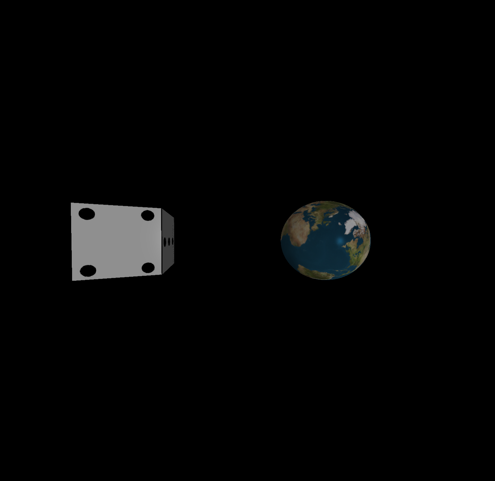
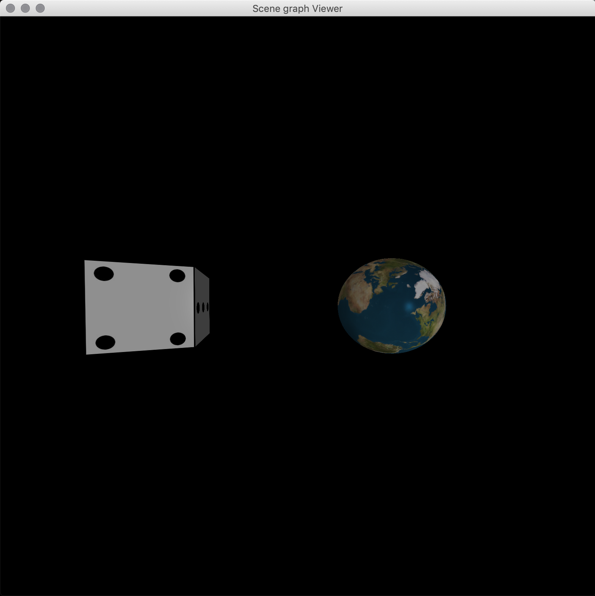
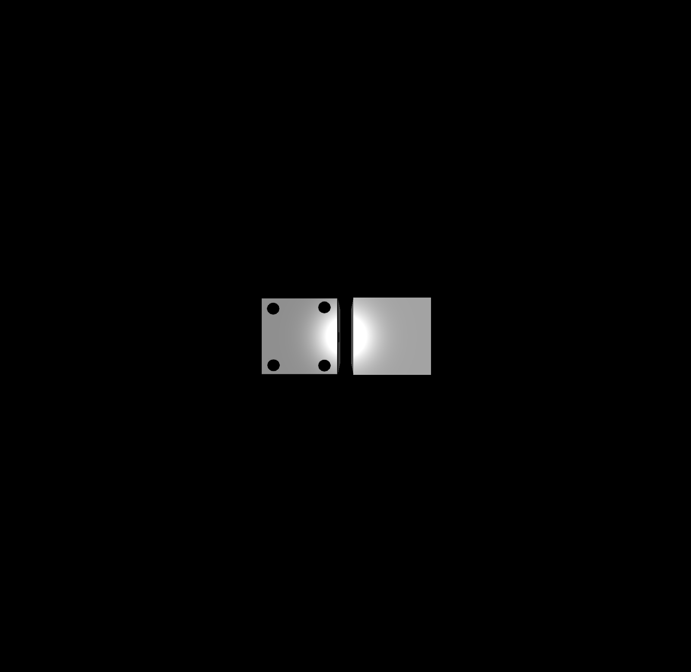
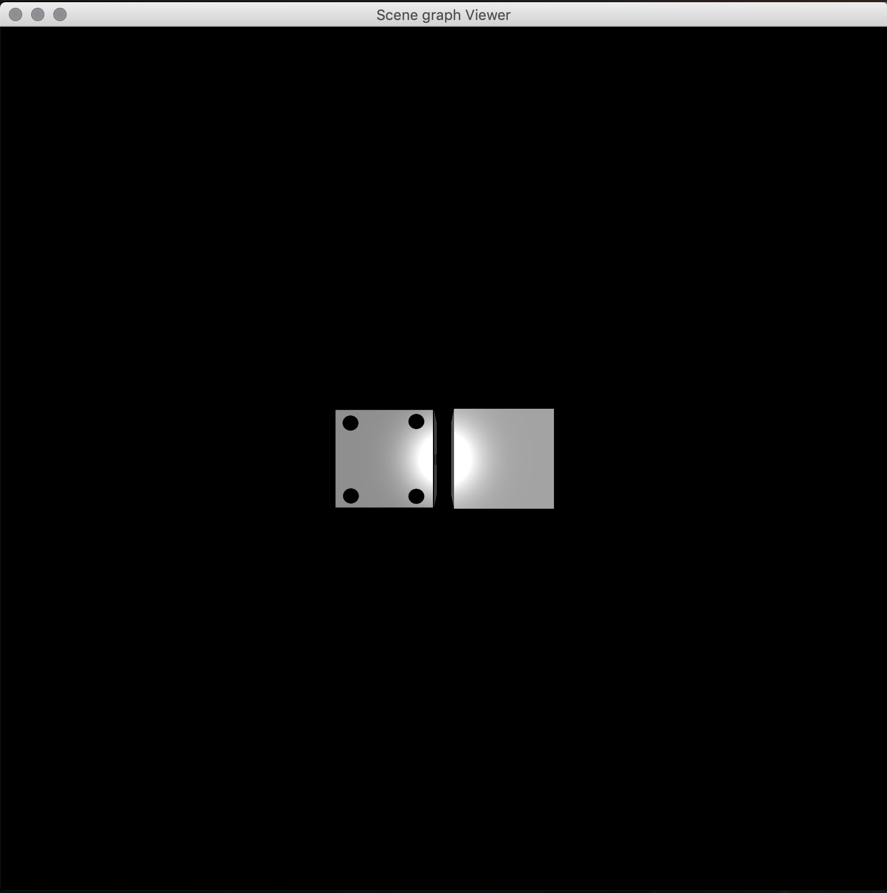
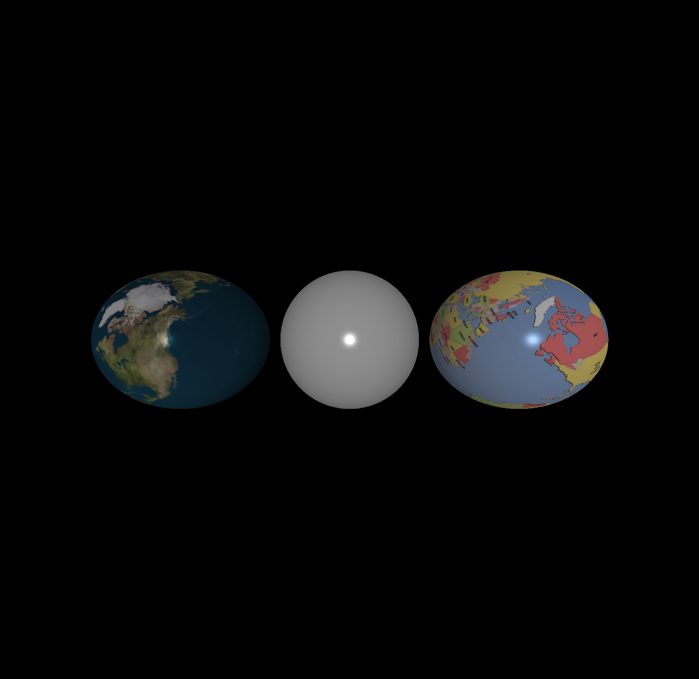
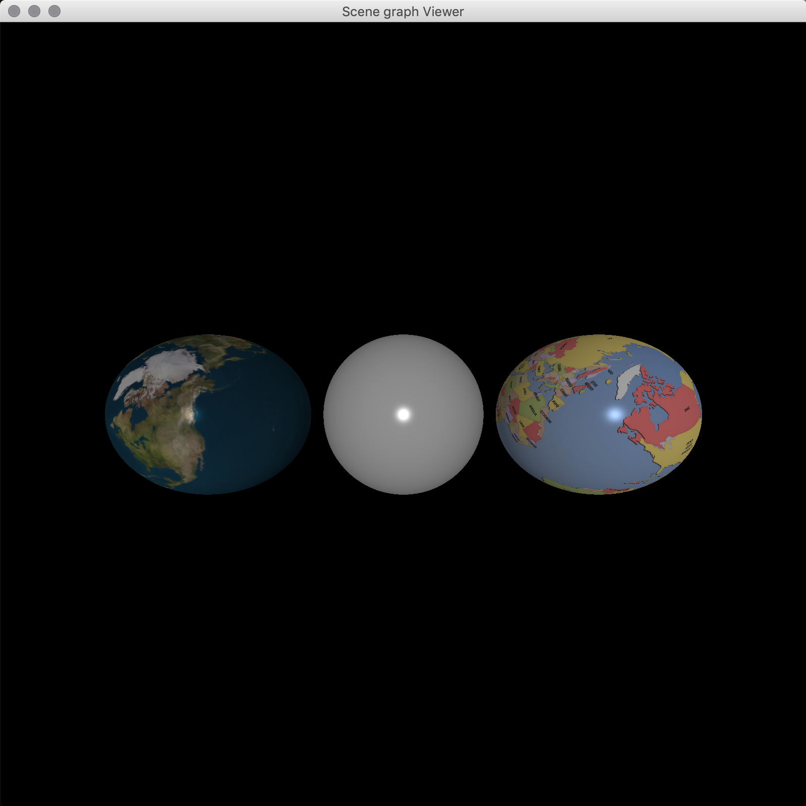
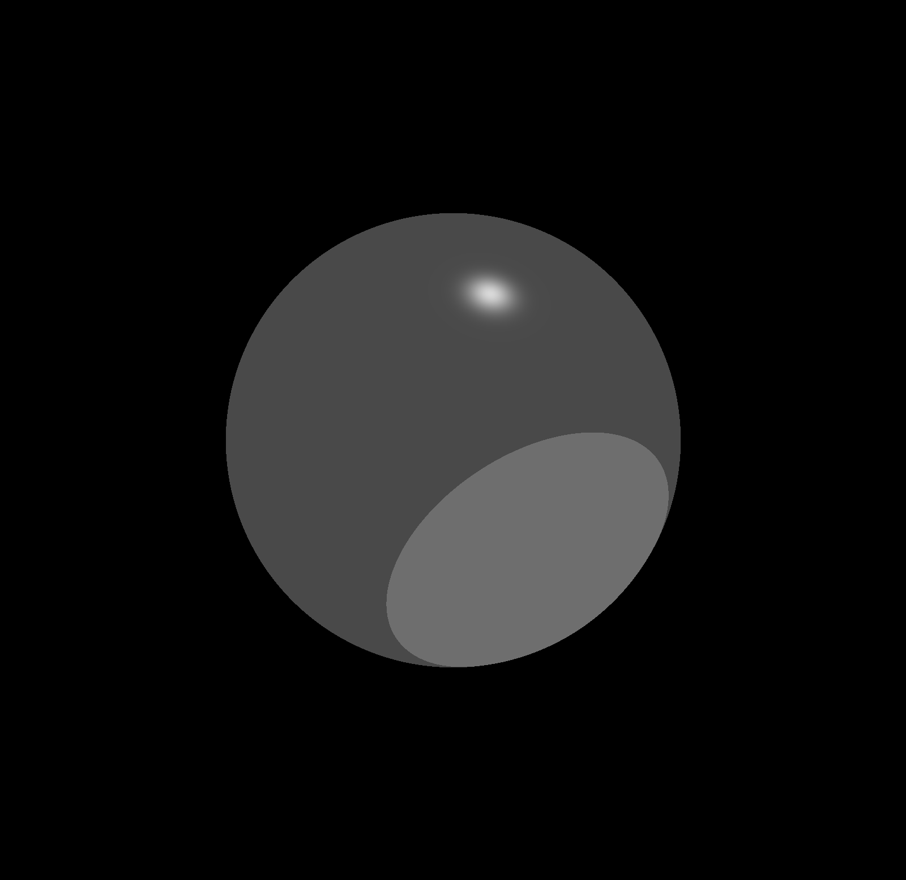
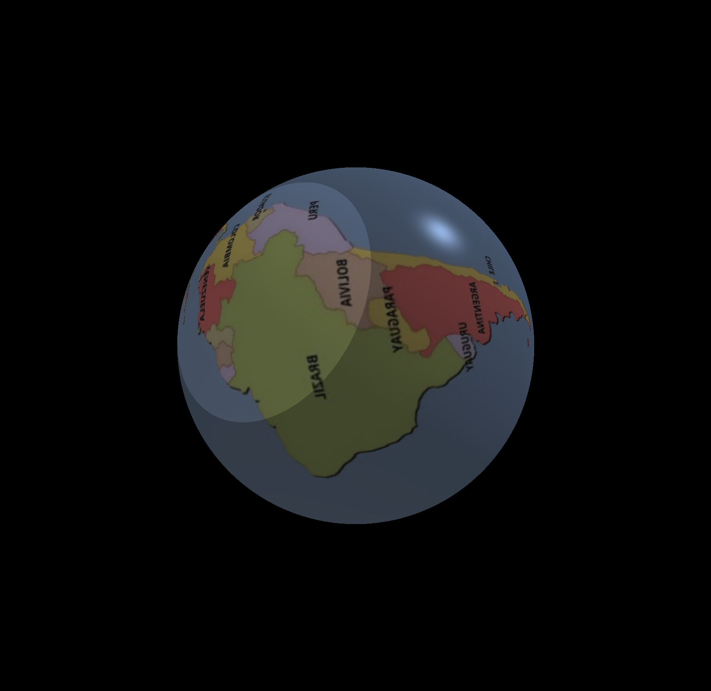

# Assignment 7

## Set Config Files to Run the Code

  All the config files are under `src/main/resources/configs`

  For example, just copy `src/main/resources/configs/camera.config` to configuration and the code is going to run.

  `camera.config` is displaying the final rendering. Camera position: (0,0,30) looking at (0,0,0).

  We are rendering a die and an earth.

  Similarly, other 3 files work as well, including `camera.config`, `box.config`, `sphere.config` and `light.config`.

## Final rendering
  This is a render from ray tracer
  
  This is a render from OpenGL
  

## box rendering
  There are two box in this scene. One has texture, the other doesn't.
  This is a render from ray tracer
  
  This is a render from OpenGL
  

## sphere rendering

  There are three spheres in this scene.
  This is a render from ray tracer
  
  This is a render from OpenGL
  

## light works
  There is a spot light and a directional light
  This is a render from ray tracer
  

## Texture works
  This is a render from ray tracer
  

**You may find that the map is inversed in our renderings. We have asked this problem in Piazza and we were told to fit our image with OpenGL even though openGL is rendering the wrong one. We were originally rendering the "correct" image and inverted our rendering after reading the Piazza post.**
